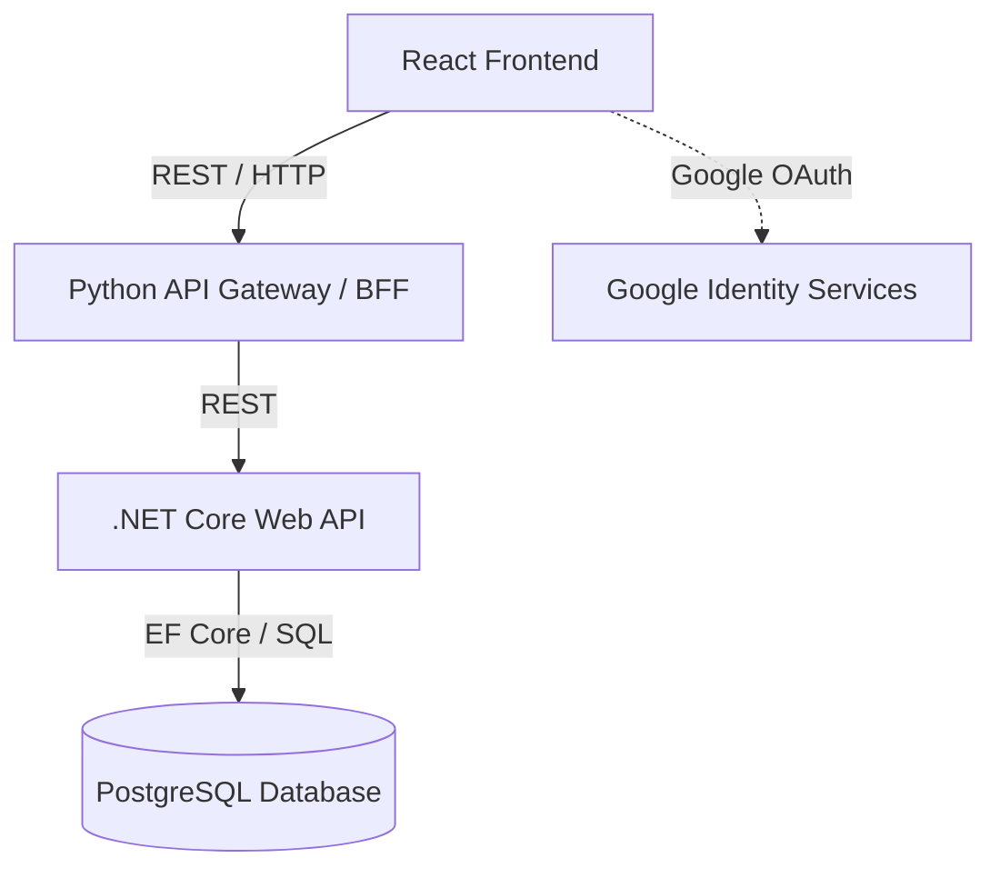

# Content Platform Architecture & Implementation Plan

This document outlines the architecture and implementation strategy for your content-based website (Articles, Papers, Blogs).

## Architecture Overview

To fulfill your requirements of a scalable, loosely coupled system with a React frontend, a Python middle layer, and a .NET Core data layer, we will use a **Microservices-oriented API Gateway (BFF) Pattern**.

### 1. Database: PostgreSQL

**Recommendation: PostgreSQL**
PostgreSQL is the industry standard for lightweight, highly secure open-source databases that easily scale to handle massive data (using partitioning and indexing).

- **Publicly Available Database to Start**: [Neon.tech](https://neon.tech/) or [Supabase](https://supabase.com/). Both offer instantly available, publicly accessible serverless PostgreSQL databases with generous free tiers, perfect for starting out.
- **Why**: Excellent JSON support, highly performant, handles massive content efficiently, and integrates seamlessly with .NET Core via Npgsql.

### 2. Core Backend (.NET Core 8)

- **Role**: Handles core business logic, strict data validation, CRUD operations, and direct Database interactions using Entity Framework Core.
- **Security**: Ensures Row-Level Security and Role-Based Access Control (RBAC) at the data level.

### 3. Middle Layer (Python FastAPI)

- **Role**: Acts as the Backend-for-Frontend (BFF). Your React app will make calls to this Python layer.
- **Purpose**: Python is excellent for data aggregation. If you plan to add AI features (recommendations, auto-summarization, sentiment analysis) or robust data scraping later, having this Python layer already in place gives you a massive advantage.
- **Tech**: `FastAPI` (extremely fast, very lightweight, built-in Swagger UI).

### 4. Frontend (React)

- **Role**: User Interface and Interaction.
- **Styling**: We will build an attractive, premium UI using modern vanilla CSS structure (to ensure maximum control, vivid colors, glassmorphism, and micro-animations) ensuring the website leaves a strong impression.
- **Pages/Sections**: Home, Articles list/detail, Login/Profile, About Us, Contact Us, Dashboard (for Writers/Admins).
- **Auth**: Readers can access public content freely. We will integrate **Google Sign-In** for Creators/Commenters. Authorization state will flow down to the DB APIs.

### 5. DevOps & Hosting (Azure)

- **Containerization**: Each layer (React, Python, .NET) will have its own `Dockerfile`.
- **Local Dev**: A `docker-compose.yml` to spin up the entire stack seamlessly.
- **Azure Hosting plan**: Azure Container Apps or Azure App Service for Containers.
- **CI/CD**: GitHub Actions workflows to automatically build Docker images, push to Azure Container Registry (ACR), and deploy to Azure.

---

## User Review Required

> [!IMPORTANT]
> **Database Credentials & Setup**
> For the next phase, we need an actual database. You can quickly sign up for a free PostgreSQL database at [Neon (neon.tech)](https://neon.tech/) and provide the connection string, OR I can set up a local PostgreSQL container in `docker-compose` for local development first. Which do you prefer?

<!-- -->

> [!WARNING]
> **Google Login Configuration**
> To implement Google OAuth, you will eventually need a Google Cloud Platform `Client ID`. We can stub this out for now or you can provide one if you have it ready.

## Proposed Changes

### Setup Monorepo Structure

We will structure the repository using a monorepo approach for ease of development:

#### [NEW] `frontend/`

React Vite application. Includes components for Home, About, Contact, Articles, and Auth.

- Routing, Context API for state management.
- Custom premium CSS design system.

#### [NEW] `middle-tier/`

Python FastAPI application.

- `main.py` entry point.
- API routers for forwarding frontend requests to .NET and handling intermediate caching or formatting.
- `requirements.txt`.

#### [NEW] `data-service/`

ASP.NET Core Web API project.

- Entitiy Framework Core models (`Article`, `User`, `Role`, `Comment`).
- Repositories/Controllers.

#### [NEW] `docker-compose.yml`

Local orchestration for all three services, allowing you to run the whole stack with `docker compose up`.

#### [NEW] `.github/workflows/azure-deploy.yml`

GitHub Actions CI/CD script for building the containers and deploying to Azure.

## Open Questions

1. **Local vs Cloud DB for Dev**: Shall we start with a local database in Docker for immediate development, or do you want to set up an online one (like Neon/Supabase) right now?
2. **Initial Content Types**: Aside from text and titles, do articles need specific fields out of the box? (e.g., tags, categories, thumbnail images)?

## Verification Plan

### Automated/Local Tests

- Run `docker compose up --build` and ensure all 3 services start.
- Test endpoints on `.NET API` Swagger UI.
- Test endpoints on `Python FastAPI` Swagger UI.

### Manual Verification

- Verify the React App loads correctly with the premium design system.
- Verify seamless navigation between Home, Articles, About, and Contact.
- Ensure unauthorized users can view content but cannot create content.
